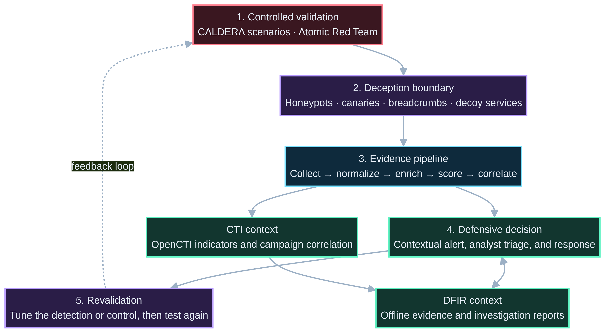
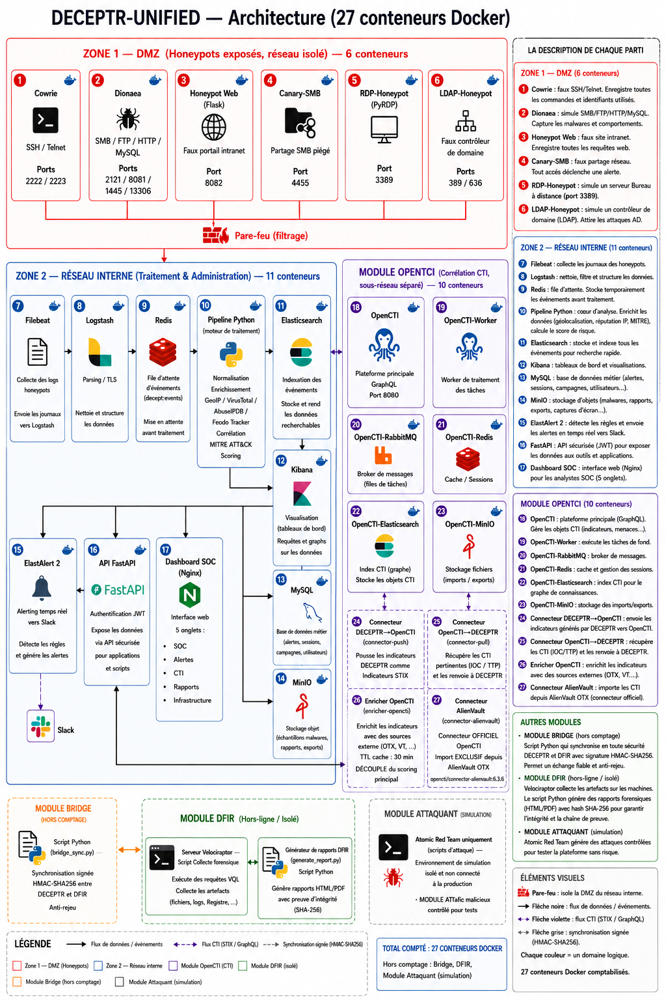

# DECEPTR-UNIFIED

**Cyberdeception · DFIR · threat-intelligence correlation · authorized attack validation**

DECEPTR-UNIFIED is a validation-driven security platform design that connects deception signals, forensic context, threat intelligence, and controlled adversary simulation into one defensive feedback loop.

> **Portfolio showcase:** This repository documents the architecture, selected sanitized configurations, validation approach, and engineering decisions for a private personal implementation. It intentionally excludes complete source code, operational secrets, and environment-specific deployment material.

[Architecture](docs/architecture-unifiee.md) · [Security policy](SECURITY.md) · [Configuration examples](config) · [Report an issue](../../issues)

---

## The defensive feedback loop

| 1 · Deceive | 2 · Observe | 3 · Correlate | 4 · Validate | 5 · Harden |
|:--|:--|:--|:--|:--|
| Present controlled decoys, canaries, and breadcrumbs. | Capture high-signal interaction and telemetry. | Enrich events with DFIR and CTI context. | Reproduce authorized scenarios with controlled emulation. | Improve the response logic and re-test the result. |

The project is designed to answer a practical question: **when a decoy or monitored asset is touched, can the system produce contextual evidence that an analyst can trust and act on?**

---

## Public case-study evidence

### A controlled validation narrative

A validation run begins inside an authorized lab with an interaction against a decoy service, canary, breadcrumb, or monitored deception surface. The resulting event is normalized and enriched, evaluated for risk and detection context, surfaced to the defensive workflow, and made available for DFIR and CTI correlation. The scenario is then repeated after tuning to validate the improvement.

This is a **defensive validation pattern**, not a guide for attacking third-party systems. Every offensive capability in the private implementation is constrained to owned, simulated, CTF, or explicitly permitted environments.

| Evidence layer | Publicly documented in this repository |
|:--|:--|
| Deception strategy | Decoys, honeypots, canary files, honeyports, fake directory services, and breadcrumbs. |
| Validation approach | Controlled CALDERA and atomic test scenarios mapped to MITRE ATT&CK. |
| Detection pipeline | Normalization, enrichment, correlation, risk scoring, alerting, and response design. |
| DFIR / CTI integration | Offline forensic collection, shared alert/IOC concepts, and OpenCTI correlation architecture. |
| Safety boundary | Sanitized examples only; no secrets, production topology, or full implementation source. |

---

## Architecture at a glance

### Security system flow

This simplified view explains the complete feedback loop first: authorized validation creates controlled evidence; deception creates high-signal interaction; the pipeline adds context; defensive decisions connect to CTI and DFIR; the result is tuned and revalidated.

### Component architecture

The detailed architecture joins five responsibilities: **deception**, **collection and pipeline processing**, **storage and enrichment**, **DFIR and threat-intelligence correlation**, and **authorized attack simulation**. The component map, trust boundaries, and technology choices are available in the [architecture dossier](docs/architecture-unifiee.md).

| Domain | Core design responsibility |
|:--|:--|
| Cyberdeception | Create believable high-signal interaction points without exposing real systems. |
| Pipeline | Normalize events, enrich relevant context, score risk, and route defensible alerts. |
| DFIR | Preserve evidence and connect investigation findings to observed activity. |
| CTI | Correlate indicators and techniques with campaign-level context. |
| Validation | Exercise the defensive path through controlled ATT&CK-aligned scenarios. |

---

## What this public repository contains

| Included | Intentionally excluded |
|:--|:--|
| Architecture documentation and system diagrams | Complete private application source |
| Sanitized Docker and configuration examples | Credentials, private endpoints, and infrastructure inventories |
| Security policy, issue templates, and contribution workflow | Privileged orchestration and operational deployment details |
| Representative design decisions and validation context | Any sensitive material from third parties or personal environments |

---

## Technology landscape

The documented design brings together **FastAPI**, **Docker**, **OpenCTI**, **Elastic Stack components**, **Velociraptor**, **CALDERA**, **atomic testing**, and deception tooling such as **Cowrie** and **Dionaea**. Each component has a specific role in the defensive loop; the project is not a collection of tools presented without context.

---

## Responsible use

> **Responsible use:** The project is for authorized security research, cyber-range learning, CTF environments, and defensive validation. Do not use its concepts, configurations, or documentation to target systems you do not own or lack explicit permission to test.

Please report security concerns through the repository’s [security policy](SECURITY.md). For technical context, begin with the [architecture dossier](docs/architecture-unifiee.md).

---

## Roadmap

- [ ] Publish additional redacted validation evidence showing the complete detection-to-decision loop.
- [ ] Add a concise technique-to-telemetry-to-response matrix for authorized scenarios.
- [ ] Expand the public architecture notes with threat-model and trust-boundary annotations.
- [ ] Continue refining the private implementation through controlled validation.

## Author

**Yassir Zahidi** — Adversary-informed security builder focused on cyberdeception, detection engineering, DFIR, and authorized security testing.

[Portfolio](https://y-zahidi.github.io) · [LinkedIn](https://www.linkedin.com/in/yassir-zahidi/) · [GitHub](https://github.com/y-zahidi)
