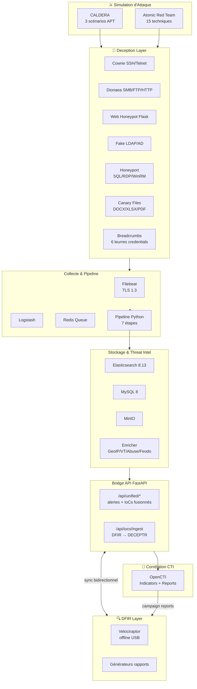

# DECEPTR-UNIFIED — Architecture Unifiée

> PFA — ISMAGI Rabat — Chambre des Représentants du Maroc
> **Yassir ZAHIDI** — Encadrants : Fikri KHALID | Ahagan OTMAN
> Version : 1.1 — 2026-07-21 (mis à jour avec les compteurs réels du repo)

---

## 1. Vue d'ensemble

DECEPTR-UNIFIED est une plateforme de cybersécurité défensive qui fusionne **quatre capacités** en un seul projet cohérent :

| Capacité | Module | Rôle |
|---|---|---|
| 🎯 **Cyberdeception** | `deception/` | Leurrer, détecter et ralentir l'attaquant |
| 🔍 **DFIR** | `dfir/` | Investiguer post-incident (Velociraptor offline) |
| ⚔️ **Simulation d'attaque** | `attacker/` | Valider la détection (CALDERA + Atomic Red Team) |
| 🧠 **Corrélation CTI** | `opencti/` | Analyser les campagnes et TTP (OpenCTI) |

Le **bridge API** (`bridge/`) assure la synchronisation bidirectionnelle des alertes et IoCs entre DECEPTR et DFIR, de sorte que **les mêmes résultats apparaissent des deux côtés**.

## 2. Diagramme d'architecture



## 3. Couches de déception

### 3.1 Honeypots passifs (existants)
- **Cowrie** (SSH:2222, Telnet:2223) — shell interactif, capture credentials + commands
- **Dionaea** (SMB:1445, FTP:2121, HTTP:8081, MySQL:13306) — capture malwares
- **Web Honeypot Flask** (:8082) — faux portail intranet Chambre des Représentants

### 3.2 Déception active (NOUVEAU)

| Leurre | Fichiers | MITRE | Détection |
|---|---|---|---|
| **Canary files** | 3 documents (Budget DOCX, Personnel XLSX, VPN PDF) avec canarytokens | T1039 | `HONEYTOKEN_TRIGGERED` CRITICAL |
| **Fake AD/LDAP** | 8 faux comptes (Administrator, krbtgt, svc_*) | T1087, T1003 | `ldap_bind_attempt` / `ldap_user_enumeration` |
| **Honeyport** | 6 ports (1433, 3389, 5985, 3306, 27017, 6379) | T1046, T1021 | `decoy_port_connection` HIGH |
| **Breadcrumbs** | 6 fausses pistes (.bash_history, .aws/credentials, .ssh/config, cron, .env, deploy_notes) | T1552 | `breadcrumb_touched` |

### 3.3 Boucle de détection
```
Attaquant touche un leurre
  → événement envoyé à Redis (deceptr:events)
  → Pipeline : normaliser → enrichir (GeoIP/VT/Abuse/Feodo/MITRE) → détecter → scorer
  → Alertes stockées (ES + MySQL) + IoCs upsertés
  → Dashboard DECEPTR affiche l'alerte en temps réel
  → Bridge sync exporte vers DFIR + OpenCTI
```

## 4. Bridge DECEPTR ↔ DFIR

### Principe
- DFIR reste **100% offline** (air-gapped USB, conformité forensique)
- Un script de synchronisation exporte les alertes DECEPTR en JSON signé (HMAC)
- Le générateur de rapports DFIR inclut une section **"Alertes DECEPTR corrélées"**
- Réciproquement, les IoCs découverts par Velociraptor remontent vers DECEPTR via `/api/iocs/ingest`

### Schéma de données partagé (`bridge/shared_schema.py`)
```python
SharedAlert: id, source, src_ip, hostname, severity,
             mitre_technique, mitre_tactic, rule, title,
             detail, risk_score, timestamp

SharedIOC:   id, source, ioc_type, value, description,
             severity, mitre_techniques, campaign, confidence
```

## 5. Simulation d'attaque

### CALDERA — 3 scénarios APT complets
1. **Discovery + Credential Access** — scan, brute force Cowrie, LDAP enum, breadcrumbs
2. **Lateral Movement** — RDP/WinRM/SSH vers faux services, cron persistence
3. **Collection + Exfiltration** — lecture canary files → déclenche tokens

### Atomic Red Team — 15 techniques ciblées
Couvre 9 tactiques ATT&CK : Credential Access, Discovery, Lateral Movement, Collection, Defense Evasion, Persistence, Exfiltration.

### Test E2E (`tests/e2e_validation.py`)
Déploie les leurres → lance simulation → vérifie détection → génère rapport HTML.

## 6. OpenCTI — Corrélation CTI

OpenCTI s'ajoute comme **couche supérieure** (à côté de VirusTotal/AbuseIPDB qui restent pour le scoring par IP) :

- Le connecteur `deceptr_to_opencti.py` ingère les IoCs DECEPTR comme **Indicators** STIX
- Les campagnes sont regroupées en **Reports** OpenCTI
- Corrélation avec les sources communautaires (MITRE, MISP, feeds externes)
- Mapping TTP automatique pour l'analyse post-incident

## 7. Accès aux services

| Service | URL | Rôle |
|---|---|---|
| Dashboard DECEPTR | http://127.0.0.1:8088 | SOC Command Center (5 onglets : SOC, Alertes, CTI, Rapports, Infrastructure) |
| API FastAPI | http://127.0.0.1:8000/docs | Endpoints unifiés |
| Kibana | http://127.0.0.1:5601 | Exploration ELK |
| OpenCTI | http://127.0.0.1:8080 | Corrélation CTI |
| CALDERA | https://127.0.0.1:8443 | Simulation attaque |
| Web Honeypot | http://127.0.0.1:8082 | Faux portail |
| MinIO | http://127.0.0.1:9001 | Stockage objet |
| Cowrie SSH | `ssh root@127.0.0.1 -p 2222` | Honeypot |
| Fake LDAP | `127.0.0.1:389` | Decoy AD |
| Velociraptor | localhost:8889 (offline) | DFIR |

## 8. Conformité

- Loi n° 05-20 relative à la cybersécurité
- Référentiel de Gestion des Incidents Ed. 2022
- ISO/CEI 27035 (gestion d'incidents)
- Notifications maCERT (`incident@macert.gov.ma`)
- Chaîne de custody SHA256/SHA512 (DFIR)

## 9. Démarrage

```powershell
cd D:\assir\Ismagi\DECEPTR-UNIFIED

# Stack principale (deception + collecte + API + dashboard)
powershell -ExecutionPolicy Bypass -File .\start.ps1

# OpenCTI (optionnel, ~4GB RAM)
cd opencti && docker compose up -d && cd ..

# CALDERA (optionnel)
cd attacker\caldera && docker compose up -d && cd ..\..

# Déployer les leurres
cd deception\decoys\canary && python canary_factory.py
cd ..\breadcrumbs && python breadcrumbs.py

# Test E2E
cd ..\..\.. && python tests\e2e_validation.py
```

## 10. Structure du projet

```
DECEPTR-UNIFIED/
├── deception/          # Honeypots + pipeline + déceptions actives
│   ├── decoys/
│   │   ├── canary/     # Générateur de faux documents canary
│   │   ├── ldap/       # Fake AD/LDAP honeypot
│   │   ├── breadcrumbs/ # Fausses pistes credentials
│   │   ├── rdp/        # RDP honeypot
│   │   └── honeyport/  # Faux services réseau (SQL/RDP/WinRM)
│   ├── cowrie/
│   │   └── honeyfs/    # 19 fichiers persona crédible
│   ├── pipeline/       # Pipeline Python 17 modules + API FastAPI 13 routes
│   ├── honeypot-web/   # Faux portail intranet (Flask)
│   ├── dionaea/        # Honeypot malware (SMB/FTP/HTTP)
│   ├── elk/            # Filebeat + Logstash + ElastAlert + Kibana setup
│   ├── mysql/          # Schéma + procédures métier
│   ├── dashboard/      # SOC Command Center (5 onglets)
│   └── docker-compose*.yml  # 5 variantes (full, hardened, lite, tpot, honeypots)
├── dfir/               # Velociraptor offline + 26 modules d'analyse
│   ├── report/         # generate_report.py + 23 analyseurs Tier 2/3
│   ├── scripts/        # Workflow USB collector
│   ├── config/         # Configs Velociraptor
│   └── intel/          # Feed DECEPTR synchronisé
├── attacker/           # Simulation d'attaque
│   ├── caldera/        # CALDERA + abilities (5 catégories)
│   └── atomic/         # Atomic Red Team (15 techniques) + real_attacks.py
├── opencti/            # OpenCTI 6.3.6 + 3 connecteurs
├── bridge/             # Sync bidirectionnel HMAC-SHA256 + schéma partagé
├── test/               # Suite pytest consolidée (1371 tests)
│   ├── dfir/           # 964 tests (30 fichiers)
│   ├── deception/      # 315 tests (11 fichiers)
│   ├── bridge/         # 58 tests
│   ├── opencti/        # 39 tests
│   └── integration/    # Scripts standalone (non collectés par pytest)
├── scripts/            # Orchestrateurs PowerShell (5 scénarios)
├── docs/               # Documentation technique
└── docker-compose.yml  # Stack unifiée (30 services)
```
